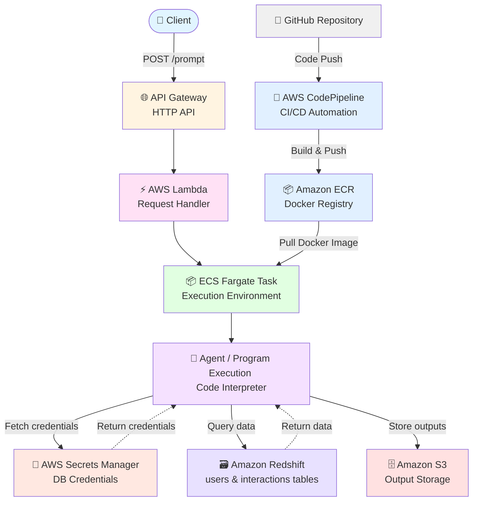

# AWS ECSを使用したCode Interpreter

**AWS**上に構築された**LLMベースのPython実行プログラム**。ユーザーのプロンプトをAPIエンドポイントにて送信、プログラムはAWSコンテナ内で実行されます。

---

## 概要

主なフロー:

- **API Gateway**経由でユーザープロンプトを受信
- **AWS Lambda**で実行をオーケストレーション
- **Amazon Bedrock**のClaude Sonnet 4.0を使用して**Amazon Redshift**データベースのテーブルに対するクエリと推論を実行し、Pythonコードを生成
- エージェントが生成したPythonコードを**ECS Fargate**上で実行
- エージェントが生成した出力は**S3**に保存(/resultsディレクトリを参照)

エージェントはデータベースのスキーマを[**DSPy**](https://dspy.ai/)を通じて理解、以下のような事が可能:

  - テーブルに関する分析的な質問への回答
  - SQLクエリの生成と実行
  - テーブルからの機械学習モデルの構築と実行
- **エラーが発生した場合、エージェントは自動的にコードを修正して再実行します**

GitHubリポジトリは**CodePipeline**を使いDockerイメージを自動で作成、**ECR**に保存

---

## データソース

**Amazon Redshift**に以下2つのテーブルを格納(/inputディレクトリに同等のCSVを格納):

- **users**テーブル
- **interactions**テーブル

**LLMエージェントはこれらのスキーマを認識しており**、直接推論とクエリ実行を行うことができます

---

## アーキテクチャ


---

#### 使い方:
以下のコードでAPIを送信するとAWS上でプログラムが起動

```python
api_gateway_url = "https://<enter-API-here>/default/lambda_python_executor"

prompt = '''
    'interaction'テーブルから機械学習モデルを作成してください。'purchase'列をターゲット変数として使用してください。
    '''

payload = {"prompt": prompt}
headers = {"Content-Type": "application/json"}
response = requests.post(api_gateway_url, json=payload, headers=headers)
```

---

## 主な機能

### 🧠 スキーマ認識エージェント
エージェントは**データベーススキーマを完全に理解**しており、以下が可能です:
- テーブル構造とカラムの自動認識
- 適切なSQLクエリの生成
- データ型を考慮した分析コードの作成

### 🔄 自動エラー修正
**実行時にエラーが発生した場合、エージェントは自動的に:**
- エラーメッセージを分析
- コードを修正
- 再実行を試行

### 📊 データ駆動型分析
ユーザーはプロンプトを送信するだけで:
- 複雑なデータ分析
- 機械学習モデルの構築
- レポートの自動生成

が可能になります。

---
